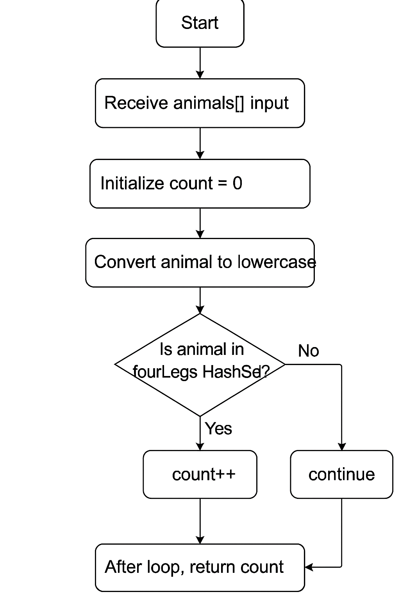

# Animal-Leg-Count-in-the-Forest

Problem Statement
Given an array of animal names, return the number of animals that have exactly four legs.
Example:
Input: ["lion", "monkey", "deer", "snake", "elephant"]
Output: 3

Clarifying Questions
These are the questions I would ask in an interview to ensure full understanding:
- Should capitalization matter?
→ I will treat input as case‑insensitive.
- What should happen with unknown animals?
→ Unknown animals are treated as having 0 legs.
- Can the input array be empty?
→ Yes, and the result should be 0.
- Can the input contain duplicates?
→ Yes, each occurrence counts.
- Do we need to handle null values?
→ For this assignment, we assume no nulls.

Approach
 Data Structure Choice: HashSet<String>
A HashSet provides O(1) average lookup time, making it ideal for checking whether an animal belongs to the “four‑legged” group.
 Steps
- Create a HashSet of known four‑legged animals.
- Loop through the input array.
- Convert each animal to lowercase.
- Check membership in the HashSet.
- Increment the counter when matched.
- Return the final count.
This approach is clean, readable, and efficient.

## Flow Chart

 Time & Space Complexity
Time Complexity: O(n)
- We loop through the array once → n operations
- Each HashSet lookup is O(1)
- Total:
O(n)
Space Complexity: O(1)
- The HashSet contains a fixed number of animals (6)
- No additional data structures grow with input size
- Total:
O(1)

 Optimization Discussion
Original Solution
- Uses a HashSet for O(1) lookups
- Clean and readable
- Already optimal in time complexity
Possible Optimization: Switch Statement

Trade‑offs
| Approach | Pros                                      | Cons                             |
|----------|-------------------------------------------|----------------------------------|
| HashSet  | Easy to maintain, scalable, readable      | Slight constant space overhead   |
| Switch   | Removes HashSet → slightly lower space    | Harder to update, less clean     |

Conclusion
The HashSet version is the best balance of clarity, maintainability, and performance.

Unit Tests (JUnit 5)
 Normal Cases (3)
  - Mixed animals
  - Multiple four‑legged animals
  - Repeated animals
 Edge Cases (3)
  - Uppercase / mixed case
  - No four‑legged animals
  - All four‑legged animals

